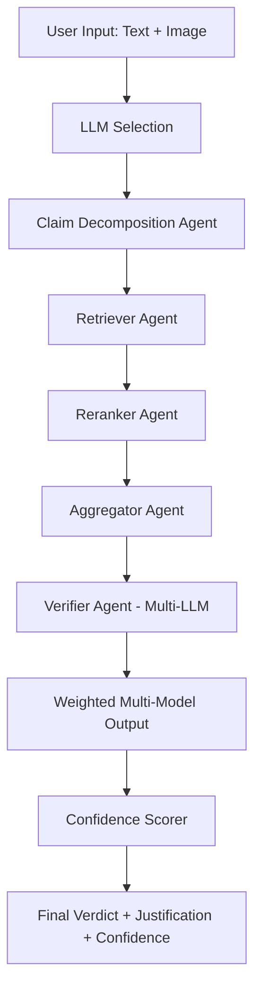
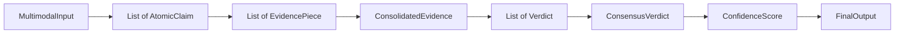

# Design Document

## Overview

KEPLER (Knowledge Extraction Pipeline for Logical Evidence and Reasoning) is a modular, agent-based fact-verification system that processes multimodal inputs (text and images) through a sequential pipeline to produce confidence-calibrated verdicts. The system architecture emphasizes transparency, interpretability, and multi-model consensus to reduce bias and improve reliability.

The core design philosophy centers on:
- **Modularity**: Each agent has a single, well-defined responsibility
- **Traceability**: Every decision is logged and can be inspected
- **Multi-model consensus**: Leveraging multiple LLMs reduces single-model bias
- **Evidence-based reasoning**: All verdicts are grounded in retrieved, ranked evidence

## Architecture

### High-Level Pipeline

The system follows a sequential pipeline architecture with seven distinct stages:

```
Input → Claim Decomposition → Retrieval → Reranking → Aggregation → Verification → Confidence Scoring → Output
```

Each stage is implemented as an independent agent or component that:
- Receives structured input from the previous stage
- Performs a specific transformation or analysis
- Outputs structured data for the next stage
- Logs its operations for traceability

### System Flow



### Technology Stack Considerations

**LLM Integration**: The system should support multiple LLM providers (OpenAI, Anthropic, open-source models via APIs). A unified interface will abstract provider-specific details.

**Web Retrieval**: Use search APIs (e.g., Google Custom Search, Bing Search API) combined with web scraping libraries (e.g., BeautifulSoup, Playwright for JavaScript-heavy sites).

**Image Processing**: Leverage reverse image search APIs (Google Vision API, TinEye) and multimodal LLMs (GPT-4V, Claude 3) for image understanding.

**Evidence Storage**: Use a structured format (JSON) to store retrieved evidence with metadata (source URL, timestamp, credibility score, content summary).

## Components and Interfaces

### 1. Input Processing Module

**Responsibility**: Accept and validate user inputs, manage LLM selection.

**Interface**:
```python
class InputProcessor:
    def accept_input(self, text: Optional[str], image: Optional[bytes]) -> MultimodalInput
    def select_llms(self, available_models: List[str], n: int) -> List[LLM]
    def designate_decomposition_model(self, selected_models: List[LLM]) -> LLM
```

**Data Structures**:
```python
@dataclass
class MultimodalInput:
    text: Optional[str]
    image: Optional[bytes]
    image_metadata: Optional[ImageMetadata]
    timestamp: datetime
    selected_llms: List[LLM]
    decomposition_model: LLM
```

### 2. Claim Decomposition Agent

**Responsibility**: Extract atomic claims from complex input text.

**Interface**:
```python
class ClaimDecompositionAgent:
    def decompose(self, text: str, model: LLM) -> List[AtomicClaim]
    def validate_atomicity(self, claim: AtomicClaim) -> bool
```

**Data Structures**:
```python
@dataclass
class AtomicClaim:
    id: str
    text: str
    is_atomic: bool
    parent_claim: Optional[str]
    verification_status: Optional[str]
```

**Decomposition Strategy**: Use few-shot prompting with the designated LLM to break down compound claims. The prompt should emphasize:
- Each atomic claim must be independently verifiable
- Preserve the original meaning and context
- Avoid introducing new information not present in the original claim

### 3. Retriever Agent

**Responsibility**: Collect multimodal evidence from the web using multiple search strategies.

**Interface**:
```python
class RetrieverAgent:
    def web_search(self, claim: AtomicClaim, max_results: int) -> List[WebSource]
    def image_search(self, query: str, max_results: int) -> List[ImageSource]
    def reverse_image_search(self, image: bytes) -> List[ImageSource]
    def scrape_and_summarize(self, source: Source) -> EvidencePiece
    def filter_by_date(self, sources: List[Source], claim_date: datetime) -> List[Source]
    def exclude_domains(self, sources: List[Source], blocklist: List[str]) -> List[Source]
```

**Data Structures**:
```python
@dataclass
class Source:
    url: str
    title: str
    publish_date: Optional[datetime]
    domain: str
    content_type: str  # 'text', 'image', 'video'

@dataclass
class EvidencePiece:
    source: Source
    summary: str
    raw_content: str
    relevance_score: Optional[float]
    credibility_score: Optional[float]
```

**Temporal Filtering**: All searches must be constrained to content published before the claim date to prevent anachronistic evidence.

**Domain Exclusion**: Maintain a blocklist of fact-checking sites (Snopes, PolitiFact, etc.) and restricted domains to prevent evidence leakage.

### 4. Reranker Agent

**Responsibility**: Filter and prioritize evidence based on relevance, credibility, and recency.

**Interface**:
```python
class RerankerAgent:
    def rank_evidence(self, evidence: List[EvidencePiece], claim: AtomicClaim) -> List[EvidencePiece]
    def calculate_relevance(self, evidence: EvidencePiece, claim: AtomicClaim) -> float
    def calculate_credibility(self, source: Source) -> float
    def calculate_recency_score(self, publish_date: datetime, claim_date: datetime) -> float
    def get_domain_credibility(self, domain: str) -> float
```

**Credibility Tiers**:
- **Tier 1 (0.9-1.0)**: Published academic papers, peer-reviewed journals
- **Tier 2 (0.7-0.89)**: Verified news sources (Reuters, AP, BBC)
- **Tier 3 (0.4-0.69)**: General news sites, established blogs
- **Tier 4 (0.0-0.39)**: Social media, unverified sources

**Domain Credibility Factors**:
```python
@dataclass
class DomainCredibility:
    agreement_score: float  # Historical accuracy
    citation_density: float  # How often cited by credible sources
    authorship_quality: float  # Author credentials
    stability: float  # Domain age and consistency
    link_authority: float  # Backlink quality
```

**Ranking Formula**:
```
final_score = (0.4 * relevance) + (0.4 * credibility) + (0.2 * recency)
```

### 5. Aggregator Agent

**Responsibility**: Synthesize multimodal evidence and apply chain-of-thought reasoning.

**Interface**:
```python
class AggregatorAgent:
    def consolidate_evidence(self, evidence: List[EvidencePiece]) -> ConsolidatedEvidence
    def apply_chain_of_thought(self, evidence: ConsolidatedEvidence, claim: AtomicClaim) -> ReasoningChain
    def identify_agreements(self, evidence: List[EvidencePiece]) -> List[Agreement]
    def identify_conflicts(self, evidence: List[EvidencePiece]) -> List[Conflict]
    def identify_gaps(self, evidence: List[EvidencePiece], claim: AtomicClaim) -> List[InformationGap]
```

**Data Structures**:
```python
@dataclass
class ConsolidatedEvidence:
    textual_evidence: List[str]
    visual_evidence: List[bytes]
    metadata: Dict[str, Any]
    evidence_map: Dict[str, List[EvidencePiece]]  # Maps claim aspects to supporting evidence

@dataclass
class ReasoningChain:
    steps: List[ReasoningStep]
    agreements: List[Agreement]
    conflicts: List[Conflict]
    gaps: List[InformationGap]

@dataclass
class ReasoningStep:
    step_number: int
    description: str
    evidence_used: List[str]  # Evidence IDs
    conclusion: str
```

**Chain-of-Thought Strategy**: The aggregator uses an LLM to generate structured reasoning that:
1. Identifies key aspects of the claim
2. Maps evidence to each aspect
3. Notes where evidence agrees or conflicts
4. Highlights missing information
5. Builds a logical argument chain

### 6. Verifier Agent

**Responsibility**: Generate verdicts and justifications using multiple LLMs in parallel.

**Interface**:
```python
class VerifierAgent:
    def verify_with_ensemble(self, claim: AtomicClaim, evidence: ConsolidatedEvidence, models: List[LLM]) -> List[Verdict]
    def verify_single(self, claim: AtomicClaim, evidence: ConsolidatedEvidence, model: LLM) -> Verdict
    def parallel_verify(self, claim: AtomicClaim, evidence: ConsolidatedEvidence, models: List[LLM]) -> List[Verdict]
```

**Data Structures**:
```python
@dataclass
class Verdict:
    model_id: str
    classification: str  # 'Supported', 'Refuted', 'Not Enough Information'
    justification: str
    confidence: float
    evidence_references: List[str]  # Source URLs used in reasoning
```

**Verification Prompt Structure**:
```
Given the claim: "{claim}"
And the following evidence: {evidence_summary}

Analyze the evidence and determine if the claim is:
- Supported: Evidence strongly confirms the claim
- Refuted: Evidence strongly contradicts the claim  
- Not Enough Information: Evidence is insufficient or inconclusive

Provide your verdict and a detailed justification referencing specific evidence.
```

### 7. Weighted Multi-Model Output Component

**Responsibility**: Aggregate individual model verdicts into a consensus.

**Interface**:
```python
class MultiModelAggregator:
    def aggregate_verdicts(self, verdicts: List[Verdict]) -> ConsensusVerdict
    def majority_poll(self, verdicts: List[Verdict]) -> str
    def aggregate_justifications(self, verdicts: List[Verdict]) -> str
```

**Data Structures**:
```python
@dataclass
class ConsensusVerdict:
    final_classification: str
    consensus_justification: str
    individual_verdicts: List[Verdict]
    agreement_level: float  # Percentage of models agreeing
```

**Aggregation Strategy**:
- Use simple majority voting for classification
- If tie, default to "Not Enough Information"
- Summarize justifications by extracting common reasoning patterns
- Preserve dissenting opinions in metadata for transparency

### 8. Confidence Scorer

**Responsibility**: Calculate and present confidence scores based on multiple factors.

**Interface**:
```python
class ConfidenceScorer:
    def calculate_confidence(self, consensus: ConsensusVerdict, evidence: List[EvidencePiece]) -> ConfidenceScore
    def assess_source_reliability(self, evidence: List[EvidencePiece]) -> float
    def assess_model_agreement(self, verdicts: List[Verdict]) -> float
    def assess_evidence_recency(self, evidence: List[EvidencePiece]) -> float
```

**Data Structures**:
```python
@dataclass
class ConfidenceScore:
    overall_score: float  # 0.0 to 1.0
    source_reliability: float
    model_agreement: float
    evidence_recency: float
    structured_justification: StructuredJustification

@dataclass
class StructuredJustification:
    summary: str
    key_evidence: List[EvidencePiece]
    reasoning_chain: ReasoningChain
    source_links: List[str]
```

**Confidence Formula**:
```
confidence = (0.35 * source_reliability) + (0.40 * model_agreement) + (0.25 * evidence_recency)
```

## Data Models

### Core Data Flow



### Complete Data Model

```python
from dataclasses import dataclass
from typing import Optional, List, Dict, Any
from datetime import datetime
from enum import Enum

class VerdictType(Enum):
    SUPPORTED = "Supported"
    REFUTED = "Refuted"
    NOT_ENOUGH_INFO = "Not Enough Information"

@dataclass
class ImageMetadata:
    format: str
    size_bytes: int
    dimensions: tuple[int, int]
    hash: str

@dataclass
class LLM:
    model_id: str
    provider: str
    version: str
    api_endpoint: str

@dataclass
class MultimodalInput:
    text: Optional[str]
    image: Optional[bytes]
    image_metadata: Optional[ImageMetadata]
    timestamp: datetime
    selected_llms: List[LLM]
    decomposition_model: LLM

@dataclass
class AtomicClaim:
    id: str
    text: str
    is_atomic: bool
    parent_claim: Optional[str]
    verification_status: Optional[VerdictType]

@dataclass
class Source:
    url: str
    title: str
    publish_date: Optional[datetime]
    domain: str
    content_type: str

@dataclass
class DomainCredibility:
    agreement_score: float
    citation_density: float
    authorship_quality: float
    stability: float
    link_authority: float
    
    def calculate_overall(self) -> float:
        return (self.agreement_score * 0.3 + 
                self.citation_density * 0.2 + 
                self.authorship_quality * 0.2 + 
                self.stability * 0.15 + 
                self.link_authority * 0.15)

@dataclass
class EvidencePiece:
    id: str
    source: Source
    summary: str
    raw_content: str
    relevance_score: Optional[float]
    credibility_score: Optional[float]
    recency_score: Optional[float]
    final_rank_score: Optional[float]

@dataclass
class Agreement:
    evidence_ids: List[str]
    common_assertion: str
    strength: float

@dataclass
class Conflict:
    evidence_ids: List[str]
    conflicting_assertions: List[str]
    severity: float

@dataclass
class InformationGap:
    missing_aspect: str
    importance: float

@dataclass
class ReasoningStep:
    step_number: int
    description: str
    evidence_used: List[str]
    conclusion: str

@dataclass
class ReasoningChain:
    steps: List[ReasoningStep]
    agreements: List[Agreement]
    conflicts: List[Conflict]
    gaps: List[InformationGap]

@dataclass
class ConsolidatedEvidence:
    textual_evidence: List[str]
    visual_evidence: List[bytes]
    metadata: Dict[str, Any]
    evidence_map: Dict[str, List[EvidencePiece]]
    reasoning_chain: Optional[ReasoningChain]

@dataclass
class Verdict:
    model_id: str
    classification: VerdictType
    justification: str
    confidence: float
    evidence_references: List[str]

@dataclass
class ConsensusVerdict:
    final_classification: VerdictType
    consensus_justification: str
    individual_verdicts: List[Verdict]
    agreement_level: float

@dataclass
class StructuredJustification:
    summary: str
    key_evidence: List[EvidencePiece]
    reasoning_chain: ReasoningChain
    source_links: List[str]

@dataclass
class ConfidenceScore:
    overall_score: float
    source_reliability: float
    model_agreement: float
    evidence_recency: float
    structured_justification: StructuredJustification

@dataclass
class FinalOutput:
    original_input: MultimodalInput
    atomic_claims: List[AtomicClaim]
    consensus_verdict: ConsensusVerdict
    confidence_score: ConfidenceScore
    processing_metadata: Dict[str, Any]
    trace_log: List[Dict[str, Any]]
```


## Correctness Properties

*A property is a characteristic or behavior that should hold true across all valid executions of a system—essentially, a formal statement about what the system should do. Properties serve as the bridge between human-readable specifications and machine-verifiable correctness guarantees.*

### Property 1: Input acceptance for text
*For any* valid text string, the system should accept it as input without error and create a MultimodalInput object.
**Validates: Requirements 1.1**

### Property 2: Input acceptance for images
*For any* valid image data, the system should accept it as input without error and create a MultimodalInput object.
**Validates: Requirements 1.2**

### Property 3: LLM selection validity
*For any* positive integer n and any pool of available LLMs where n ≤ pool size, the system should allow selection of exactly n models from the pool.
**Validates: Requirements 1.4**

### Property 4: Decomposition model designation
*For any* set of selected LLMs, the designated decomposition model should be a member of that set.
**Validates: Requirements 1.5**

### Property 5: Claim extraction non-emptiness
*For any* non-empty input text, the claim decomposition should produce at least one atomic claim.
**Validates: Requirements 2.1**

### Property 6: Compound claim decomposition
*For any* input text containing multiple factual statements (compound claim), the decomposition should produce more than one atomic claim.
**Validates: Requirements 2.4**

### Property 7: Web search invocation
*For any* atomic claim, the retriever agent should invoke the web search function at least once.
**Validates: Requirements 3.1**

### Property 8: Image search invocation for visual content
*For any* input containing visual content, the retriever agent should invoke both image search and reverse image search functions.
**Validates: Requirements 3.2, 3.3**

### Property 9: Evidence summarization
*For any* retrieved source, the evidence passed to subsequent stages should contain a summary field that is non-empty.
**Validates: Requirements 3.4**

### Property 10: Temporal consistency
*For any* claim with date D and any retrieved evidence, all evidence should have publish_date < D or publish_date = null.
**Validates: Requirements 3.5**

### Property 11: Domain exclusion
*For any* retrieved evidence and any domain in the exclusion list (fact-checking sites, restricted domains), no evidence should have a source domain matching the exclusion list.
**Validates: Requirements 3.6, 3.7**

### Property 12: Relevance-based filtering
*For any* set of evidence with relevance scores, the reranker output should exclude evidence below a relevance threshold.
**Validates: Requirements 4.1**

### Property 13: Credibility-based ordering
*For any* set of evidence with different credibility scores, the reranker output should be ordered such that higher credibility evidence appears before lower credibility evidence.
**Validates: Requirements 4.2**

### Property 14: Recency influence on ranking
*For any* two pieces of evidence with identical relevance and credibility but different publish dates, the more recent evidence should rank higher.
**Validates: Requirements 4.3**

### Property 15: Domain credibility calculation completeness
*For any* domain credibility calculation, all five factors (agreement, citation density, authorship, stability, link authority) should be incorporated into the final score.
**Validates: Requirements 4.7**

### Property 16: Unknown domain neutral scoring
*For any* domain not in the known domain database, the credibility score should be set to a neutral default value (0.5).
**Validates: Requirements 4.8**

### Property 17: Evidence filtering by rank
*For any* ranked evidence list, only evidence with final_rank_score above a threshold should be passed to subsequent stages.
**Validates: Requirements 4.9**

### Property 18: Multimodal evidence consolidation
*For any* set of ranked evidence containing text, images, and metadata, the aggregator output should contain consolidated representations of all three types.
**Validates: Requirements 5.1, 5.2, 5.3**

### Property 19: Chain-of-thought generation
*For any* consolidated evidence, the aggregator should produce a ReasoningChain with at least one reasoning step.
**Validates: Requirements 5.4**

### Property 20: Agreement detection
*For any* set of evidence where multiple pieces support the same assertion, the aggregator should identify and record at least one Agreement.
**Validates: Requirements 5.5**

### Property 21: Conflict detection
*For any* set of evidence where pieces contradict each other, the aggregator should identify and record at least one Conflict.
**Validates: Requirements 5.6**

### Property 22: Information gap detection
*For any* claim with aspects not covered by retrieved evidence, the aggregator should identify and record at least one InformationGap.
**Validates: Requirements 5.7**

### Property 23: All models engaged
*For any* set of n selected LLMs, the verifier should produce exactly n individual verdicts.
**Validates: Requirements 6.1**

### Property 24: Complete context provision
*For any* verification request, each model should receive context containing the atomic claim, textual evidence, visual evidence, and metadata.
**Validates: Requirements 6.2, 6.3, 6.4, 6.5**

### Property 25: Parallel execution
*For any* set of models, all models should be invoked concurrently (within a small time window) rather than sequentially.
**Validates: Requirements 6.6**

### Property 26: Valid verdict classification
*For any* individual verdict, the classification should be one of: "Supported", "Refuted", or "Not Enough Information".
**Validates: Requirements 6.7**

### Property 27: Justification presence
*For any* individual verdict, the justification field should be non-empty.
**Validates: Requirements 6.8**

### Property 28: Majority voting aggregation
*For any* set of individual verdicts, the consensus classification should match the classification that appears most frequently in the set.
**Validates: Requirements 7.1**

### Property 29: Justification aggregation
*For any* set of individual textual justifications, the consensus justification should be a summarized version that is shorter than the concatenation of all individual justifications.
**Validates: Requirements 7.2**

### Property 30: Valid consensus classification
*For any* consensus verdict, the final classification should be one of: "Supported", "Refuted", or "Not Enough Information".
**Validates: Requirements 7.5**

### Property 31: Confidence factors influence
*For any* two consensus verdicts with different source reliability, model agreement, or evidence recency, the confidence scores should differ accordingly.
**Validates: Requirements 8.1, 8.2, 8.3**

### Property 32: Confidence score presence
*For any* final output, a confidence score in the range [0.0, 1.0] should be present.
**Validates: Requirements 8.4**

### Property 33: Source-linked justifications
*For any* structured justification, all referenced evidence should include source URLs.
**Validates: Requirements 8.5**

### Property 34: Complete pipeline tracing
*For any* claim processed through the system, the trace log should contain entries for all pipeline stages: input processing, decomposition, retrieval, reranking, aggregation, verification, and confidence scoring.
**Validates: Requirements 9.1**

### Property 35: Evidence-referenced justifications
*For any* verdict justification, at least one specific evidence source should be referenced.
**Validates: Requirements 9.2**

### Property 36: Source link preservation
*For any* evidence source used in justification, the original source URL should be preserved and accessible in the final output.
**Validates: Requirements 9.3**

### Property 37: Stage-level inspection capability
*For any* trace log entry, it should contain sufficient information to understand what operations were performed at that pipeline stage.
**Validates: Requirements 9.4**

## Error Handling

### Error Categories

**1. Input Validation Errors**
- Invalid or corrupted image data
- Empty or null text input when text is required
- Invalid LLM selection (n > available models)

**Strategy**: Validate inputs early and return descriptive error messages. Use schema validation for structured inputs.

**2. External Service Errors**
- LLM API failures (timeout, rate limit, service unavailable)
- Web search API failures
- Image search API failures
- Web scraping failures (blocked, timeout, invalid HTML)

**Strategy**: Implement retry logic with exponential backoff. Maintain fallback options (e.g., if primary search API fails, try secondary). Log all external service errors for monitoring.

**3. Data Processing Errors**
- Claim decomposition produces no atomic claims
- No evidence retrieved for a claim
- All evidence filtered out by reranker
- LLM returns invalid verdict format

**Strategy**: Define graceful degradation paths. If no evidence is found, return "Not Enough Information" verdict with explanation. Validate LLM outputs and request regeneration if invalid.

**4. Consensus Errors**
- Tie in majority voting (equal number of verdicts for multiple classifications)
- All models fail to produce verdicts

**Strategy**: For ties, default to "Not Enough Information". If all models fail, return system error with details about which models failed and why.

### Error Response Format

```python
@dataclass
class ErrorResponse:
    error_code: str
    error_message: str
    error_stage: str  # Which pipeline stage failed
    recoverable: bool
    suggested_action: str
    trace_id: str
```

### Logging and Monitoring

- Log all errors with full context (input, stage, timestamp)
- Track error rates by category and stage
- Alert on elevated error rates or critical failures
- Maintain audit trail for all processing attempts

## Testing Strategy

### Unit Testing Approach

Unit tests will verify specific behaviors of individual components:

**Input Processing Module**:
- Test acceptance of various text formats (plain text, Unicode, special characters)
- Test acceptance of various image formats (JPEG, PNG, GIF)
- Test LLM selection with edge cases (n=1, n=max, invalid n)

**Claim Decomposition Agent**:
- Test with simple single-claim inputs
- Test with complex multi-claim inputs
- Test with ambiguous or unclear claims

**Retriever Agent**:
- Test web search invocation with mocked API
- Test domain exclusion with known blocklisted domains
- Test temporal filtering with various date combinations
- Test scraping with sample HTML

**Reranker Agent**:
- Test credibility tier assignments for known source types
- Test ranking formula with various score combinations
- Test filtering with different thresholds

**Aggregator Agent**:
- Test consolidation with mixed evidence types
- Test agreement detection with aligned evidence
- Test conflict detection with contradictory evidence

**Verifier Agent**:
- Test parallel execution timing
- Test verdict format validation
- Test context construction

**Multi-Model Aggregator**:
- Test majority voting with various distributions
- Test tie-breaking logic
- Test justification summarization

**Confidence Scorer**:
- Test confidence formula with various input combinations
- Test score normalization to [0, 1] range

### Property-Based Testing Approach

Property-based testing will verify universal properties across many randomly generated inputs using a PBT library (e.g., Hypothesis for Python, fast-check for TypeScript).

**Configuration**: Each property-based test should run a minimum of 100 iterations to ensure thorough coverage of the input space.

**Tagging**: Each property-based test must include a comment explicitly referencing the correctness property from this design document using the format: `**Feature: kepler-fact-verification, Property {number}: {property_text}**`

**Key Properties to Test**:

1. **Input acceptance properties** (Properties 1-2): Generate random text strings and image data, verify acceptance
2. **Selection and designation properties** (Properties 3-4): Generate random model pools and selection sizes
3. **Claim extraction properties** (Properties 5-6): Generate random text with varying complexity
4. **Retrieval properties** (Properties 7-11): Generate random claims and evidence with various dates and domains
5. **Ranking properties** (Properties 12-17): Generate random evidence with various scores and dates
6. **Aggregation properties** (Properties 18-22): Generate random evidence sets with known patterns
7. **Verification properties** (Properties 23-27): Generate random model sets and contexts
8. **Consensus properties** (Properties 28-30): Generate random verdict distributions
9. **Confidence properties** (Properties 31-33): Generate random factor combinations
10. **Traceability properties** (Properties 34-37): Verify trace logs for random inputs

**Smart Generators**: 
- For text: Generate strings with varying lengths, languages, special characters
- For images: Generate valid image data in different formats
- For dates: Generate dates relative to claim dates to test temporal constraints
- For evidence: Generate evidence with controlled credibility, relevance, and recency scores
- For verdicts: Generate verdict distributions to test majority voting edge cases

### Integration Testing

Integration tests will verify that components work together correctly:

- **End-to-end pipeline test**: Submit a known claim, verify complete processing through all stages
- **Multi-modal integration**: Test with both text and image inputs
- **External service integration**: Test with real (or realistic mock) API responses
- **Error propagation**: Test that errors in one stage are handled appropriately by downstream stages

### Test Data

- Maintain a curated set of test claims with known ground truth
- Include examples of supported, refuted, and ambiguous claims
- Include multimodal examples with text-image relationships
- Include edge cases: very long claims, non-English text, low-quality images

### Testing Tools

- **Unit Testing**: pytest (Python) or Jest (TypeScript)
- **Property-Based Testing**: Hypothesis (Python) or fast-check (TypeScript)
- **Mocking**: unittest.mock (Python) or Jest mocks (TypeScript)
- **Integration Testing**: pytest with real API calls or comprehensive mocks
- **Coverage**: aim for >80% code coverage, 100% for critical paths

